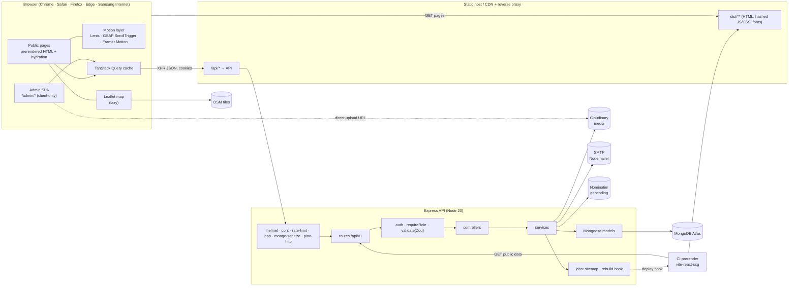
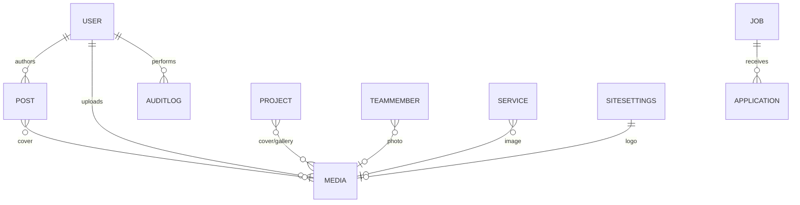
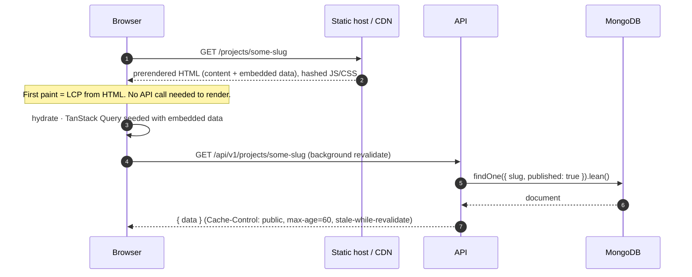
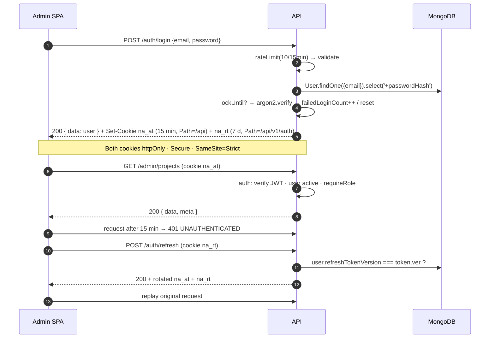

# Niraum Metals — Architecture

> Status: **v0.1 skeleton** · Owner: engineering · Last updated: 2026-10-08
>
> This document describes how the Niraum Metals website and admin CMS are built and how a request
> moves through the system. Decisions that were contested or are hard to reverse are recorded as
> ADRs in [`docs/adr/`](./adr). API details live in [API.md](./API.md), threat model and controls
> in [SECURITY.md](./SECURITY.md), environments in [DEPLOYMENT.md](./DEPLOYMENT.md).

---

## 1. Context

Niraum Metals Pvt. Ltd. (Lalitpur-13, Nepal) supplies iron ore, metal minerals and stone/aggregate.
The site serves five audiences: construction companies, steel and cement plants, government and
infrastructure buyers, investors, job seekers and local communities.

The system has two faces:

| Face        | Users                                | Rendering                                    | Priority                     |
| ----------- | ------------------------------------ | -------------------------------------------- | ---------------------------- |
| Public site | Everyone (mostly mobile, NP/SA)      | Prerendered static HTML, hydrated with React | Speed, SEO, motion, trust    |
| Admin CMS   | 1–10 staff (superadmin/admin/editor) | Client-rendered SPA under `/admin`           | Correctness, security, audit |

Both are served by one React app and one REST API backed by MongoDB Atlas.

**Design reference:** gmining.com — branded preloader, smooth page transitions, hover reveals on
project cards, scroll-driven storytelling, large project views. We copy the feel, not the content.

---

## 2. Repository layout

pnpm workspace, two packages (`frontend`, `backend`). Shared lint/format/TS settings at the root.

```
niraum-metals/
├─ frontend/                 React 18 + Vite + TS (public site + /admin)
│  ├─ public/                favicons, robots.txt, og-image.jpg, logo/ (supplied files)
│  ├─ src/
│  │  ├─ app/                router.tsx (route table), providers.tsx, App.tsx (root layout)
│  │  ├─ pages/public/       Home, About, Operations, Projects, ProjectDetail, Sustainability,
│  │  │                      News, Article, Careers, Job, Contact, Legal, NotFound
│  │  ├─ pages/admin/        Login, Dashboard, Settings, Projects, News, Jobs, Team, Media,
│  │  │                      Messages, Users
│  │  ├─ components/
│  │  │  ├─ ui/              shadcn/ui primitives (generated, not linted)
│  │  │  ├─ layout/          Navbar, Footer, AdminShell
│  │  │  ├─ sections/        Hero, Stats, Services, ProjectGallery, Timeline, NewsGrid,
│  │  │  │                   LogoMarquee, CtaBand, ContactForm, MapCard
│  │  │  ├─ motion/          Reveal, Parallax, CountUp, PageTransition, Preloader, MagneticButton
│  │  │  └─ seo/             Seo, JsonLd
│  │  ├─ features/<domain>/  api.ts (TanStack Query hooks), types.ts, schema.ts (Zod)
│  │  ├─ lib/                api.ts (axios), utils.ts (cn), motion.ts, seo.ts, theme.tsx
│  │  ├─ styles/             globals.css (tokens), glass.css, textures.css
│  │  └─ assets/             images, video posters, textures
│  ├─ tests/ (Vitest + RTL)  e2e/ (Playwright)
├─ backend/                  Node 20 + Express 4 + TS + Mongoose 8
│  └─ src/
│     ├─ config/             env.ts (Zod), db.ts, logger.ts, cloudinary.ts, mailer.ts
│     ├─ routes/ → middlewares/ → controllers/ → services/ → models/
│     ├─ validators/         Zod request schemas (same shapes as frontend types)
│     ├─ utils/  jobs/ (sitemap, rebuild hook)  seed/ (first admin + demo data)
│     ├─ app.ts (createApp, no I/O)  server.ts (DB connect + listen + graceful shutdown)
├─ docs/                     ARCHITECTURE, API, SECURITY, DEPLOYMENT, adr/
├─ .github/workflows/        ci.yml, deploy-frontend.yml, deploy-backend.yml
└─ docker-compose.yml        mongo + mailpit (dev); `--profile app` adds backend + frontend
```

---

## 3. Component diagram



**Key boundaries**

- The **frontend never talks to MongoDB, Cloudinary secrets or SMTP**. Everything goes through
  `/api/v1`.
- The API is reachable **same-site** as the website (path `/api` behind the same proxy, or an
  `api.` subdomain of the same registrable domain) so `SameSite=Strict` auth cookies work. See
  [ADR-0003](./adr/0003-auth-httponly-cookies.md).
- `app.ts` builds the Express app with no I/O, so Supertest imports it directly; `server.ts` owns
  the DB connection and the port.

---

## 4. Frontend

### 4.1 Rendering

| Route group | Strategy                                                                                                                                                                                                                                                                             |
| ----------- | ------------------------------------------------------------------------------------------------------------------------------------------------------------------------------------------------------------------------------------------------------------------------------------ |
| Public      | **Prerendered** at build by `vite-react-ssg` ([ADR-0002](./adr/0002-prerender-vite-react-ssg.md)), hydrated on load. Dynamic routes (`/projects/:slug`, `/news/:slug`, `/careers/:slug`) are expanded by each route's `getStaticPaths()` which calls the public API (`SSG_API_URL`). |
| `/admin/*`  | **Client-only**, excluded from prerender (`ssgOptions.includedRoutes`), lazy-loaded chunk, `noindex`.                                                                                                                                                                                |

Prerendered pages embed their API data (route `loader` → static loader data). On hydration the
same data seeds TanStack Query (`initialData`), which revalidates in the background, so content
edited in the CMS shows up immediately for live visitors and in the HTML after the next rebuild.

**Freshness loop:** publishing or unpublishing content calls the debounced rebuild hook
(`REBUILD_HOOK_URL`, default 120 s), which re-runs the prerender in CI/the host.

### 4.2 Route map

| Path                                                             | Page           | Data                                                |
| ---------------------------------------------------------------- | -------------- | --------------------------------------------------- |
| `/`                                                              | Home           | settings, services, featured projects, latest posts |
| `/about`                                                         | About          | settings, team                                      |
| `/operations`                                                    | Operations     | services                                            |
| `/projects`                                                      | Projects       | projects (paginated, filter by mineral/status)      |
| `/projects/:slug`                                                | ProjectDetail  | project                                             |
| `/sustainability`                                                | Sustainability | static content + settings                           |
| `/news`, `/news/:slug`                                           | News, Article  | posts                                               |
| `/careers`, `/careers/:slug`                                     | Careers, Job   | jobs; POST applications                             |
| `/contact`                                                       | Contact        | settings (address, map); POST contact               |
| `/legal/:page`                                                   | Legal          | privacy, terms, cookies                             |
| `*`                                                              | NotFound       | — (`noindex`)                                       |
| `/admin/login`                                                   | Login          | POST auth/login                                     |
| `/admin`                                                         | Dashboard      | counts, recent messages, audit                      |
| `/admin/{settings,projects,news,jobs,team,media,messages,users}` | CRUD screens   | admin endpoints                                     |

### 4.3 State and data

- **Server state:** TanStack Query only. One `features/<domain>/api.ts` per domain exports query
  keys and hooks (`useProjects`, `useProject(slug)`, `useUpdateProject`…). No global client store;
  UI state stays local.
- **HTTP:** `lib/api.ts` axios instance, `withCredentials: true`, single-flight refresh on 401
  (one `/auth/refresh` call, then replay).
- **Forms:** React Hook Form + `zodResolver`. Schemas in `features/<domain>/schema.ts` mirror
  `backend/src/validators` field-for-field; the API remains the authority.
- **Envelope types:** `ApiList<T> = { data: T[], meta }`, `ApiItem<T> = { data: T }`,
  `ApiErrorBody = { error: { code, message, details? } }`.

### 4.4 Design system

- **Tokens** in `styles/globals.css` as CSS variables, exposed to Tailwind (`tailwind.config.ts`)
  using the shadcn/ui contract (`--background`, `--primary`, …) plus raw brand colours
  (`charcoal`, `graphite`, `copper{,-light,-deep}`, `silver`, `offwhite`, `rule`).
- **Colour rules:** copper only for CTAs, active states, links and key numbers; charcoal for text
  and structure; silver for secondary lines and icons.
  _Accessibility:_ text on copper buttons is graphite (5.0 : 1), never white (3.6 : 1, fails AA);
  light-mode link text uses copper-deep (~6 : 1 on off-white).
- **Type:** Manrope Variable, self-hosted via `@fontsource-variable/manrope` (no Google Fonts
  request). H1 800 · H2 700 · H3 600 · body 400 · `.label` 500 uppercase 0.12em.
- **Themes:** light and dark are both first-class. `lib/theme.tsx` is a next-themes-style provider
  (`light | dark | system`, persisted under `niraum-theme`); an inline script in `index.html`
  sets the class before paint to avoid a flash.
- **Signature surfaces:** `.glass` / `.glass-copper` (backdrop blur ≤ 16 px with an opaque
  fallback), `.copper-glow`, `.texture-brushed`, `.texture-grain` (inline SVG noise, zero requests).
- **Logo:** supplied files only (`public/logo/`), never redrawn or recoloured.

### 4.5 Motion

| Concern             | Tool                 | Notes                                                                                                                          |
| ------------------- | -------------------- | ------------------------------------------------------------------------------------------------------------------------------ |
| Smooth scroll       | Lenis                | One instance in the root layout; its RAF drives `ScrollTrigger.update`. Disabled for `prefers-reduced-motion` and in `/admin`. |
| Scroll storytelling | GSAP + ScrollTrigger | Pinned sections, scrubbed timelines, parallax. Created in `useLayoutEffect` with `gsap.context()` and reverted on unmount.     |
| Enter/exit, hovers  | Framer Motion        | `PageTransition` (AnimatePresence keyed by pathname), `Reveal`, project card hover reveals. Presets in `lib/motion.ts`.        |
| Preloader           | `motion/Preloader`   | First visit per session only, ≤ 1.2 s, never blocks LCP content in the HTML (overlay fades out on `load`).                     |

Rules: animate only `transform` and `opacity`; no motion library code runs during prerender
(guard `typeof window`); heavy animation modules load per-route.

### 4.6 SEO

- `components/seo/Seo` wraps `Head` from `vite-react-ssg` (react-helmet-async under the hood):
  title, description, canonical, Open Graph, Twitter card, `hreflang` when localised.
- `JsonLd`: `Organization` (site-wide), `BreadcrumbList`, `NewsArticle`, `JobPosting`, `Place`
  for projects.
- `sitemap.xml` is generated by the backend job from published content; `robots.txt` disallows
  `/admin`.

---

## 5. Backend

### 5.1 Layers

```
route ──► middlewares (auth → requireRole → validate) ──► controller ──► service ──► model
                                                          (HTTP only)   (business)  (Mongoose)
```

- **Routes** declare path, method and middleware chain only.
- **Controllers** translate HTTP ⇄ service calls and shape the `{ data, meta }` envelope.
- **Services** hold business rules (slug generation, publish/rebuild triggers, audit logging,
  email, geocoding). They never touch `req`/`res`.
- **Models** define schema, indexes and small instance helpers.
- **Validators** are Zod schemas for `body`, `query` and `params`; `validate()` replaces
  `req.body`/`req.query` with the parsed (stripped, coerced) values.

### 5.2 Middleware order (`app.ts`)

1. `trust proxy` (= `TRUST_PROXY`) so `req.ip` and rate limits see the real client.
2. `pino-http` request logging (health checks skipped; cookies/authorization redacted).
3. `helmet` (CSP is set at the static host for HTML; API responses are JSON-only).
4. `cors` — allow-list from `CORS_ORIGINS`, `credentials: true`.
5. `compression`, `express.json({ limit: '100kb' })`, `urlencoded`, `cookie-parser`.
6. `express-mongo-sanitize` (strips `$`/`.` keys), `hpp` (parameter pollution).
7. `express-rate-limit`: global `/api` 300 / 15 min / IP; stricter per-route limits for
   `auth/login` (10 / 15 min), `auth/forgot` (5 / h), `contact`, `applications`, `newsletter`
   (5 / 10 min).
8. `/api/v1` routers → `notFound` → `errorHandler` (single error envelope).

### 5.3 API conventions

- Base path `/api/v1`, JSON only.
- Success: `{ data, meta? }`. Error: `{ error: { code, message, details? } }` with stable
  `code`s (`VALIDATION_ERROR`, `UNAUTHENTICATED`, `FORBIDDEN`, `NOT_FOUND`, `CONFLICT`,
  `RATE_LIMITED`, `INTERNAL`).
- Lists: `?page=1&limit=20` (`limit ≤ 50`), `?sort=-createdAt`, field filters
  (`?status=operating&mineral=iron-ore`), `?q=` text search where indexed.
  `meta = { page, limit, total, pages }`.
- Public endpoints return only `published`/`isOpen`/`isActive` documents and a public field
  projection (no internal IDs of users, no message metadata).
- Full endpoint list: [API.md](./API.md).

### 5.4 Roles

| Capability                                   | editor | admin | superadmin |
| -------------------------------------------- | :----: | :---: | :--------: |
| Projects, posts, jobs, team, services, media |   ✔    |   ✔   |     ✔      |
| Messages and applications                    |        |   ✔   |     ✔      |
| Site settings, geocode                       |        |   ✔   |     ✔      |
| Users (create, deactivate, change role)      |        |       |     ✔      |
| Audit log                                    |        |   ✔   |     ✔      |

`requireRole(...roles)` runs after `auth`. A superadmin cannot demote or deactivate the last
active superadmin.

---

## 6. Data models

All schemas use `{ timestamps: true }` (`createdAt`, `updatedAt`), `strict` mode and
`toJSON` transforms that drop `__v` and secret fields. `seo` is a shared sub-schema:
`{ title?, description?, ogImage?, noindex? }`.

### User

| Field               | Type                                             | Notes                                                               |
| ------------------- | ------------------------------------------------ | ------------------------------------------------------------------- |
| name                | String, required                                 |                                                                     |
| email               | String, required, **unique**, lowercase, trimmed | index                                                               |
| passwordHash        | String, required, `select: false`                | argon2id                                                            |
| role                | `superadmin \| admin \| editor`                  | default `editor`                                                    |
| isActive            | Boolean                                          | default `true`                                                      |
| lastLoginAt         | Date                                             |                                                                     |
| failedLoginCount    | Number                                           | reset on success                                                    |
| lockUntil           | Date                                             | set after `LOGIN_MAX_ATTEMPTS`                                      |
| refreshTokenVersion | Number                                           | bumped on logout-all / password change → invalidates refresh tokens |

### SiteSettings (singleton)

| Field                         | Type                                                                | Notes                                                                                  |
| ----------------------------- | ------------------------------------------------------------------- | -------------------------------------------------------------------------------------- |
| companyName, legalName, motto | String                                                              | defaults "Niraum Metals", "Niraum Metals Pvt. Ltd.", "Strength Forged For Generations" |
| logo                          | `{ light, dark }` (Media URLs)                                      | supplied files                                                                         |
| contact                       | `{ phone: [String], email: [String], whatsapp }`                    | **placeholders** until confirmed                                                       |
| address                       | `{ line1, city, district, province, country, postalCode }`          | seed: Lalitpur-13, Lalitpur, Bagmati, Nepal                                            |
| location                      | `{ lat, lng, zoom, manualOverride }`                                | from `settings/geocode` unless `manualOverride`                                        |
| officeHours                   | String                                                              | placeholder                                                                            |
| social                        | `[{ platform, url, isActive, order }]`                              | platform ∈ facebook, instagram, linkedin, youtube, x, tiktok, whatsapp, viber          |
| seo                           | `{ defaultTitle, defaultDescription, ogImage, keywords: [String] }` |                                                                                        |
| footer                        | `{ about, links: [{ label, href }] }`                               |                                                                                        |
| theme                         | `{ defaultMode: light \| dark \| system }`                          |                                                                                        |

Enforced singleton: fixed `_id` key (`'site'`) with upsert; public projection exposed at
`GET settings/public`.

### Project

| Field               | Type                                                   | Notes                                      |
| ------------------- | ------------------------------------------------------ | ------------------------------------------ |
| title               | String, required                                       |                                            |
| slug                | String, **unique**                                     | generated from title, editable             |
| mineral             | String                                                 | e.g. iron ore, aggregate                   |
| status              | `exploration \| development \| operating \| completed` |                                            |
| location            | `{ name, district, lat, lng }`                         | site names are **placeholders**            |
| summary             | String (≤ 300)                                         | cards                                      |
| body                | Rich text (sanitised HTML)                             |                                            |
| facts               | `[{ label, value }]`                                   | tonnage etc. **never invented**            |
| coverImage, gallery | Media refs/URLs                                        |                                            |
| featured, published | Boolean                                                | index `{ published, featured, createdAt }` |
| seo                 | SEO sub-schema                                         |                                            |

### Post (news)

`title`, `slug` (unique), `excerpt`, `body` (sanitised HTML), `coverImage`, `tags: [String]`
(index), `author` (ref User), `publishedAt` (Date), `published` (Boolean), `seo`.
Indexes: `{ published, publishedAt: -1 }`, text index on `title, excerpt`.

### Job

`title`, `slug` (unique), `department`, `location`, `type` (full-time/part-time/contract/
internship), `description`, `requirements: [String]`, `deadline` (Date), `isOpen` (Boolean).
Index `{ isOpen, deadline }`. Jobs past `deadline` are hidden publicly.

### Application

`job` (ref Job, required), `name`, `email`, `phone`, `cvUrl` (Cloudinary raw upload, PDF/DOCX
≤ `UPLOAD_MAX_MB`), `message`, `status` (`new | reviewing | shortlisted | rejected | hired`).
Index `{ job, createdAt: -1 }`.

### TeamMember

`name`, `role`, `bio`, `photo`, `order` (Number), `linkedin`. Sorted by `order`.

### Service / Operation

`title`, `slug` (unique), `icon` (lucide icon name), `summary`, `body`, `image`, `order`.

### Message (contact)

`name`, `email`, `phone`, `company`, `subject`, `message`, `ip`, `userAgent`,
`status` (`new | read | replied | spam`). Index `{ status, createdAt: -1 }`.
`ip`/`userAgent` are kept for abuse handling and purged after a retention period
(see SECURITY.md).

### Newsletter subscriber

`email` (unique), `status` (`pending | subscribed | unsubscribed`), `confirmToken`, `source`.
Double opt-in. (Needed by `POST newsletter`.)

### Media

`url`, `publicId` (Cloudinary), `alt` (required for images), `type` (image/video/document),
`size` (bytes), `width?`, `height?`, `uploadedBy` (ref User).

### AuditLog

`user` (ref User), `action` (`create | update | delete | login | logout | publish | …`),
`entity` (model name), `entityId`, `diff` (changed fields; secrets omitted), `ip`, `at` (Date).
Append-only; index `{ entity, entityId }`, `{ at: -1 }`.

### Relationships



---

## 7. Request flows

### 7.1 Public page (visitor)



### 7.2 Build-time prerender

CI (or the host's build triggered by `REBUILD_HOOK_URL`) runs `pnpm --filter frontend build`.
`vite-react-ssg` renders every public route; dynamic routes call `getStaticPaths()` →
`GET projects|posts|jobs?limit=50&page=n` to enumerate slugs, then each route `loader` fetches
its document. Output: `dist/<route>/index.html` + JSON loader data.

### 7.3 Contact form

```mermaid
sequenceDiagram
  autonumber
  participant B as Browser (ContactForm)
  participant A as API
  participant D as MongoDB
  participant M as SMTP
  B->>B: RHF + Zod validate (client)
  B->>A: POST /api/v1/contact {name, email, …, honeypot}
  A->>A: rateLimit(5/10min/IP) → validate(Zod) → honeypot/spam heuristics
  A->>D: Message.create({…, ip, userAgent, status: new|spam})
  A->>M: notify MAIL_TO_CONTACT (async; failure logged, not surfaced)
  A-->>B: 201 { data: { id } }
```

Job applications follow the same path with `multer` (memory storage, type/size checks) streaming
the CV to Cloudinary before `Application.create`.

### 7.4 Admin login and token refresh



Logout clears both cookies and increments `refreshTokenVersion` (all sessions end).
Forgot/reset uses a single-use, hashed, 30-minute token emailed via SMTP; responses are identical
whether or not the email exists.

### 7.5 Admin write (e.g. publish a project)

`PUT /admin/projects/:id` → `auth` → `requireRole('editor','admin','superadmin')` →
`validate(projectUpdate)` → controller → `projectService.update()`:

1. sanitise `body` HTML (allow-list), regenerate slug if title changed and slug not locked;
2. save; write `AuditLog` with the field diff;
3. if `published` changed or a published doc changed → `jobs/sitemap` regenerate +
   debounced `jobs/rebuild` call to `REBUILD_HOOK_URL`.

### 7.6 Settings geocode

`POST /admin/settings/geocode` (admin+) builds a query from `address`, calls Nominatim through
`node-geocoder` (identifying `GEOCODER_EMAIL`, ≤ 1 req/s, cached), returns candidates. The admin
picks one or drags the map pin; saving sets `location` and `manualOverride: true` when dragged.

### 7.7 Media upload

Admin uploads go to `POST /admin/media` (multer memory storage, MIME sniffing, size limit) →
Cloudinary upload stream into `CLOUDINARY_FOLDER` → `Media.create`. Delivery uses Cloudinary
transformation URLs (`f_auto,q_auto,w_…`) so the frontend requests AVIF/WebP at the right width
through `srcset`.

---

## 8. Security summary

Detail in [SECURITY.md](./SECURITY.md). Highlights: argon2id hashes; short-lived access JWT +
rotating refresh JWT in httpOnly `Secure` `SameSite=Strict` cookies; account lockout; per-route
rate limits; Zod validation on every input; Mongo operator stripping (`express-mongo-sanitize`

- `sanitizeFilter`); HTML sanitising for rich text; helmet headers + CSP at the host; CORS
  allow-list; role checks on every admin route; append-only audit log; secrets only in env, validated
  at boot (the API refuses to start in production with placeholder secrets).

---

## 9. Non-functional targets → how we meet them

| Target                          | Mechanism                                                                                                                                                                                                                 |
| ------------------------------- | ------------------------------------------------------------------------------------------------------------------------------------------------------------------------------------------------------------------------- |
| Lighthouse ≥ 90 ×4 (mobile)     | Prerendered HTML, self-hosted variable font with `font-display: swap`, critical CSS inlined by beasties, route-level code splitting, Leaflet/GSAP loaded only where used, semantic landmarks, alt text required in Media. |
| LCP < 2.5 s                     | Hero poster image (AVIF/WebP, `fetchpriority="high"`, explicit size) is the LCP element; hero video starts after load and only on fast connections (`navigator.connection`, `prefers-reduced-data`).                      |
| CLS < 0.1                       | Width/height on all media, reserved space for navbar (`--header-h`), font metric fallback, preloader overlays rather than shifts content.                                                                                 |
| INP < 200 ms                    | Transform/opacity-only animation, passive listeners, blur ≤ 16 px, no long tasks in scroll handlers (GSAP batches), React transitions for filters.                                                                        |
| API p95 < 300 ms                | Indexed queries with `.lean()` and projections, `limit ≤ 50`, connection pool, compression, `Cache-Control` on public GETs, settings cached in memory (invalidated on PUT).                                               |
| Browsers incl. Samsung Internet | Vite target `es2020`, autoprefixer, `backdrop-filter` fallback, Playwright on Chromium/Firefox/WebKit + mobile.                                                                                                           |
| 320 → 2560 px                   | Tailwind `xs`…`4xl` breakpoints, fluid type, container max 1440 px with full-bleed media.                                                                                                                                 |

---

## 10. Configuration and environments

| Environment | Frontend                                   | API                                                                                   | DB                         |
| ----------- | ------------------------------------------ | ------------------------------------------------------------------------------------- | -------------------------- |
| local       | `vite` :5173 (proxy `/api`)                | `tsx watch` :4000                                                                     | docker `mongo:7` + Mailpit |
| CI          | `vite-react-ssg build`, Vitest, Playwright | Vitest + Supertest (no DB needed for health; `mongodb-memory-server` for model tests) | in-memory                  |
| production  | static host / CDN (TBD)                    | container (TBD)                                                                       | MongoDB Atlas              |

All configuration is environment variables, documented in `frontend/.env.example` and
`backend/.env.example`. Backend env is parsed by Zod in `config/env.ts` at boot; any invalid
value stops the process. Only `VITE_*` variables reach the browser.

---

## 11. Placeholder register (unknown facts — never invent)

| Fact                                 | Where it appears                        | Current value                     |
| ------------------------------------ | --------------------------------------- | --------------------------------- |
| Founding year                        | About, Timeline, JSON-LD `foundingDate` | `[PLACEHOLDER: founding year]`    |
| Licences / permits                   | About, Sustainability                   | `[PLACEHOLDER: licences]`         |
| Site / mine names, coordinates       | Projects                                | `[PLACEHOLDER: site name]`        |
| Tonnage, capacity, reserves          | Stats, Project facts                    | `[PLACEHOLDER: tonnage]`          |
| Staff count                          | Stats, Careers                          | `[PLACEHOLDER: staff count]`      |
| Phone, email, WhatsApp               | SiteSettings.contact, Footer            | `[PLACEHOLDER: phone/email]`      |
| Social links                         | SiteSettings.social                     | empty, `isActive: false`          |
| Company registration / PAN / VAT no. | Footer, Legal                           | `[PLACEHOLDER: registration no.]` |
| Office hours                         | Contact                                 | `[PLACEHOLDER: office hours]`     |
| Production domain                    | robots.txt, sitemap, canonical          | `example.com`                     |
| Logo source files                    | `frontend/public/logo/`                 | awaiting client files             |

Placeholders render visibly (styled `[PLACEHOLDER …]`) in non-production builds and are blocked
by a pre-release check (`grep PLACEHOLDER dist/`) before go-live.

---

## 12. Open questions

1. Hosting targets for the static site and the API (drives `deploy-*.yml` and the rebuild hook).
2. Is Nepali (ने) localisation required at launch? (Affects routing: `/ne/...` + `hreflang`.)
3. Newsletter: own double-opt-in list (current plan) or an external provider?
4. Retention period for contact messages and job applications (privacy notice).
5. Production email: company SMTP or a transactional provider (Resend is the fallback option).
